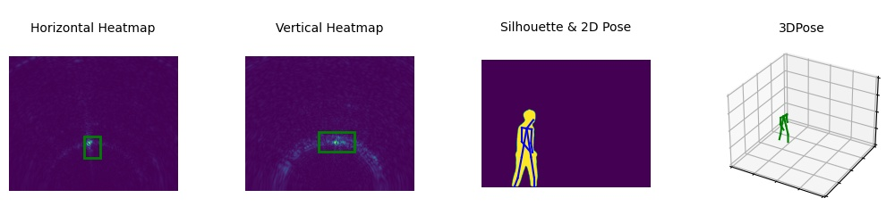

# HIBERTools

>This is a toolbox of loading and visualizing HIBER dataset. We also provide tool functions to generate lmdb format files for fast training.

## Dataset File Structure

Our HIBER dataset has 5 main categories collected in 10 different environment.

- **ACTION** : Single person performing four actions (**stand, walk, sit, squat**) with normal light and no occlusions. 
- **DARK** : Single or multiple people walk randomly in darkness.
- **MULTI** : Multiple people walk randomly with normal light and no occlusions.
- **OCCLUSION** : Single or multiple people walk randomly with three kind of occlusions (**styrofoam occlusion, carton occlusion and yoga mat occlusion**).
- **WALK** : Single person walk randomly with normal light and no occlusions.

All the train, val and test set of HIBER have the same file structure as follows.

```text
.
├── ACTION
│   ├── ANNOTATIONS
│   │   ├── 2DPOSE
│   │   │   ├── 01_01.npy
│   │   │   ├── 01_02.npy
│   │   │   └── ...
│   │   ├── 3DPOSE
│   │   │   ├── 01_01.npy
│   │   │   ├── 01_02.npy
│   │   │   └── ...
│   │   ├── BOUNDINGBOX
│   │   │   ├── HORIZONTAL
│   │   │   │   ├── 01_01.npy
│   │   │   │   ├── 01_02.npy
│   │   │   │   └── ...
│   │   │   └── VERTICAL
│   │   │       ├── 01_01.npy
│   │   │       ├── 01_02.npy
│   │   │       └── ...
│   │   └── SILHOUETTE
│   │       ├── 01_01
│   │       │   │── 0000.npy
│   │       │   └── ...
│   │       └── 01_02
│   │           |── 0000.npy
│   │           └── ...
│   ├── HORIZONTAL_HEATMAPS
│   │   ├── 01_01
│   │   │   |── 0000.npy
│   │   │   └── ...
│   │   └── 01_02
│   │       |── 0000.npy
│   │       └── ...
│   └── VERTICAL_HEATMAPS
│       ├── 01_01
│       │   |── 0000.npy
│       │   └── ...
│       └── 01_02
│           |── 0000.npy
│           └── ...
├── DARK (Same as Action directory, omitted here)
├── MULTI (Same as Action directory, omitted here)
├── OCCLUSION (Same as Action directory, omitted here)
└── WALK (Same as Action directory, omitted here)
```

## Data format

>Note that: Optical data is collected under the setting of **10 fps** and RF data is collected under **20 fps**, thus **two** adjacent RF frames were **stacked** together for the convenience of alignment with annotations generated by optical data.

### Variable definition
* env : the environment number, candidate value is [1, 2, 3, 4, 5, 6, 7, 8, 9, 10].
* grp_idx : the group index, the data is collected group by group, each group of data elapses one minute.
* frame_idx: the optical frame index in each group.
* radar_frame_idx: the RF frame index in each group.
* grp_frame_num : the number of optical frames in each group, it should be 600, We slice out the last ten frames and make it **590** for the purpose of alignment.
* num_of_person : the number of people present in the current environment.
* num_kp : the number of human keypoints, 14 in our case.

### Shape explanation

* 2DPOSE :
    * file name : "%02d_%02d.npy" % (env, grp_idx)
    * shape : (grp_frame_num, num_of_person, num_kp, 2) *# (x, y)*
* 3DPOSE :
    * file name : "%02d_%02d.npy" % (env, grp_idx)
    * shape : (grp_frame_num, num_of_person, num_kp, 3) *# (x, y, z)*
* BOUNDINGBOX :
    * file name : "%02d_%02d.npy" % (env, grp_idx)
    * shape : (grp_frame_num, num_of_person, 4) *# xyxy*
* SILHOUETTE :
    * directory name : "%02d_%02d" % (env, grp_idx)
    * file name : "%04d.npy" % frame_idx
    * shape: (num_of_person, 1248, 1640) *# related to optical camera resolution, height is 1248, width is 1640*
* HORIZONTAL_HEATMAPS / VERTICAL_HEATMAPS :
    * directory name : "%02d_%02d" % (env, grp_idx)
    * file name : "%04d.npy" % radar_frame_idx
    * shape: (160, 200, 2) *# radar frame resolution, height is 160, width is 200, 2 denote two adjacent frames*

## Install
```text
pip install git+https://github.com/wuzhiwyyx/HIBER.git@main#subdirectory=HIBERTools
```

## Usage

### 1. Create dataset object and show statistics
```py
import HIBERTools as hiber

root_path = '/data/hiber'
# create train dataset using the default data split strategy.
dataset = hiber.HIBERDataset(root=root_path, categories=['WALK'], mode='train') 

# If you only want to check dataset information, instead of load/visualize/save data. 
# You can leave 'root' None.
# dataset = hiber.HIBERDataset(categories=['WALK'], mode='train') 

info = dataset.info()
print(info)
```
>Note: We highly recommend that you use the default data split strategy. If you want to split the data customly, use the code below.
```py
# create train dataset using your customized JSON format file
dataset = hiber.HIBERDataset(root_path, categories=['WALK'], mode='train', 
                                data_file='PATH/TO/YOUR/CUSTOMIZED/JSON/FILE') 

# Your JSON file should be like as follows.
# {
#     'Train': {
#         'WALK': ['07_01', '05_02'],
#         'MULTI': []
#     },
#     'Val': {
#         'WALK': ['07_05', '05_09'],
#         'MULTI': []
#     },
#     'Test': {
#         'WALK': ['07_03', '05_04'],
#         'MULTI': []
#     }
# }
```

You will get the following results, which indicating **current ( train / val / test )** dataset information:
```text
TRAIN subset of HIBER Dataset.
99 groups, 58410 samples in total.

Detailed information is as follows.
{
    "WALK": 99
}

You can save to lmdb format by calling datastobj.save_as_lmdb function.
```

You can get complete information of **HIBER Dataset** by:
```py
complete_info = dataset.complete_info()
print(complete_info)
```
The output will be:
```text
HIBERDataset statistic info:

Main categories and their corresponding number of groups:
Each group contains 590 optical frames (annotations) and 1180 RF frames.
If you want to know precise group list of each categories, please access datasetobj.statistics attribute.

{
    "WALK": 152,
    "MULTI": 120,
    "ACTION": 143,
    "OCCLUSION": 244,
    "DARK": 31
}

Detailed categories and their corresponding number of groups:
These detailed categories are all included in main categories.
If you want to know precise group list of each detailed categories, please access datasetobj.details attribute.

{
    "occlusion_styrofoam": 84,
    "occlusion_carton": 84,
    "occlusion_yoga": 76,
    "occlusion_multi": 112,
    "occlusion_action": 6,
    "dark_multi": 12,
    "dark_light_change": 7
}

Train/Validation/Test set are splited as follows.
Train set
{
    "WALK": 99,
    "MULTI": 91,
    "ACTION": 100,
    "OCCLUSION": 192,
    "DARK": 0
}

Validation set
{
    "WALK": 26,
    "MULTI": 14,
    "ACTION": 21,
    "OCCLUSION": 26,
    "DARK": 0
}

Test set
{
    "WALK": 27,
    "MULTI": 15,
    "ACTION": 22,
    "OCCLUSION": 26,
    "DARK": 31
}
```

>Note: Both **test** and **validation** set contain **new environment** and **new persons** which are not present in **train** set. And **DARK** category is included in test set only.

### 2. Visualize data

```text
import random

seq = random.randint(0, len(dataset) - 1)
data_item = dataset[seq]
hiber.visualize(data_item, 'result.jpg')

```
You will get the visualized result saved as result.jpg in current folder. 

Or you can plot the results directly by omitting output file name.
```py
hiber.visualize(data_item)
```
the meaning of data_item is as follows
```py
data_item[0] # horizontal heatmaps of shape (160, 200, 2), numpy.ndarray, float64
data_item[1] # vertical heatmaps of shape (160, 200, 2), numpy.ndarray, float64
data_item[2] # pose2d of shape (num_of_person, 14, 2), numpy.ndarray, float64
data_item[3] # pose3d of shape (num_of_person, 14, 3), numpy.ndarray, float64
data_item[4] # horizontal boundingbox of shape (num_of_person, 4), numpy.ndarray, float64
data_item[5] # vertical boundingbox of shape (num_of_person, 4), numpy.ndarray, float64
data_item[6] # silhouette of shape (num_of_person, 1248, 1640), numpy.ndarray, bool
```

### 3. Save as LMDB

```py
dataset.save_as_lmdb('hiber_train.lmdb')
```

### 4. Load from LMDB

```py
keys = dataset.get_lmdb_keys()

env = lmdb.open('hiber_train.lmdb', readonly=True, lock=False, readahead=False, meminit=False)
with env.begin(write=False) as txn:
    key = keys[0]
    data_item = []
    for k in key:
        buf = txn.get(k.encode('ascii'))
        # the dtype of silhouette label is bool, others are float64
        if k.startswith('m'):
            data = np.frombuffer(buf, dtype=bool)
        else:
            data = np.frombuffer(buf, dtype=np.float64)
        data_item.append(data)
    data_item[0] = data_item[0].reshape(160, 200, 2)
    data_item[1] = data_item[1].reshape(160, 200, 2)
    data_item[2] = data_item[2].reshape(-1, 14, 2)
    data_item[3] = data_item[3].reshape(-1, 14, 3)
    data_item[4] = data_item[4].reshape(-1, 4)
    data_item[5] = data_item[5].reshape(-1, 4)
    data_item[6] = data_item[6].reshape(-1, 1248, 1640)
    hiber.visualize(data_item, 'lmdb.jpg')
```