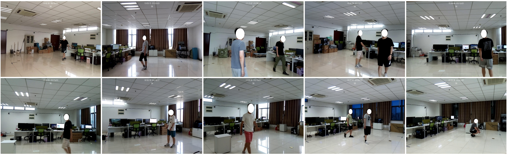
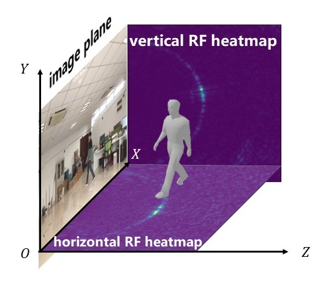
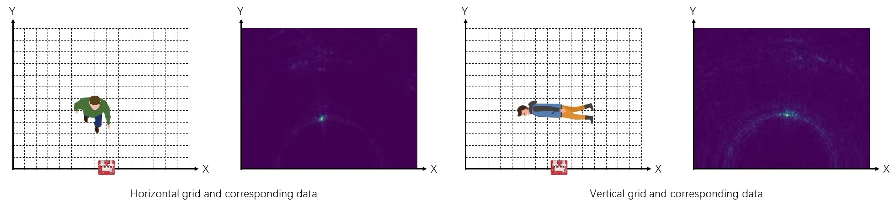

# HIBER(Human Indoor Behavior Exclusive RF dataset)

HIBER(Human Indoor Behavior Exclusive RF dataset) is an open-source mmWave human behavior recognition dataset collected from multiple domains(i.e. various environments, users, occlusions and actions). It can be used to study human position tracking, human behavior recognition, human pose estimation, and human silhouette generation tasks. The total size of the processed dataset is 400GB, including rf heatmaps, RGB images, 2D/3D human skeletons, bounding boxes and human silhouette ground-truth. Following we introduce the composition and implementation details of this dataset.

## Dataset Introduction

- **10 environments**：placing FMCW radars in ten 10 different places of the same room
- **10 volunteers**：10 users with different ages, heights and weights.
- **4 actions**: stand, walk, sit, squat
- **3 occlusions**：styrofoam occlusion, carton occlusion and yoga mat occlusion
- **3 annotations**: 2D/3D human pose indicating human actions, bounding boxes indicating human positions and human silhouette results

## Dataset Implementation

### Hardware Configuration

- This dataset is collected by two TI AWR2243 mmWave radars, each of which is composed of an MMWCAS-DSP-EVM (left two images) and an MMWCAS-RF-EVM (right two images).
  

- The parameters of the radars are set as follows:

Parameter|Value|Parameter|Value
:--:|:--:|:--:|:--:
Start frequency|77 GHz / 79 Ghz|Sample points |256
Frequency slope|38.5 MHz/µs|Sample rate |8 Msps
Idle time |5 µs|Chirps in one frame |1
Ramp end time |40 µs|Frame Interval |50 ms

Under these settings the radar achieves a frame rate of **20fps**, a range resolution of **0.122m**. We activate **12** transmitting antennas and **16** receiving antennas to obtain an approximately angular resolution of **1.3°**.

### Data preprocessing

    

As depicted in the above figure, two FMCW radars are placed perpendicular to each other to collect RF signals from horizontal and vertical plane, respectively.

The raw signals are processed into RF heatmaps based on AoA-ToF (Angle of Arrival, Time of Flight) and beamforming technology, and the subtraction between adjacent frames is adopted to eliminate static object reflections in the environment and amplify the dynamic reflections.

