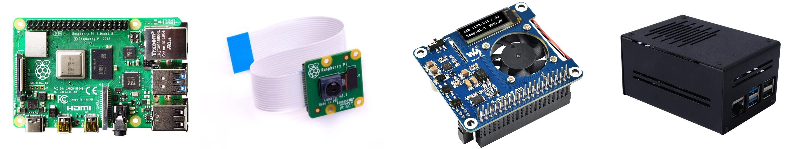
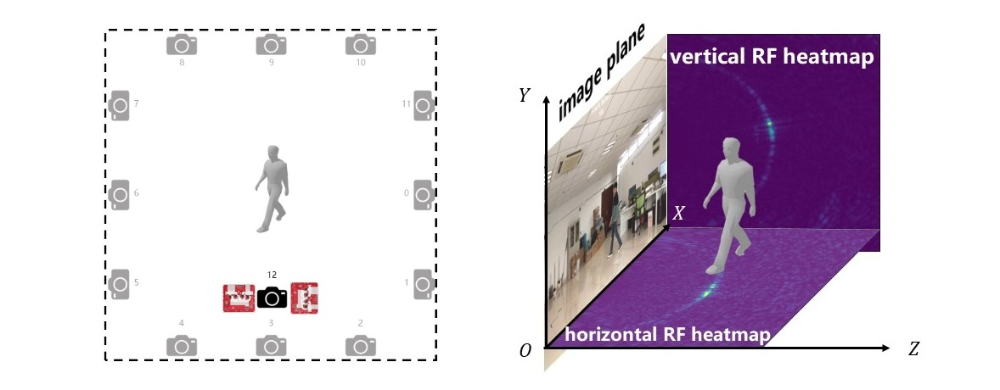
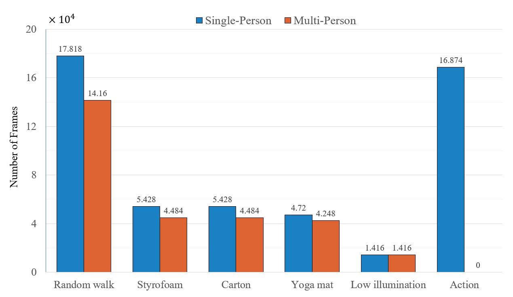

# HIBER(Human Indoor Behavior Exclusive RF dataset)

HIBER(Human Indoor Behavior Exclusive RF dataset) is an open-source mmWave human behavior recognition dataset collected from multiple domains(i.e. various environments, users, occlusions and actions). It can be used to study human position tracking, human behavior recognition, human pose estimation, and human silhouette generation tasks. The total size of the processed dataset is 400GB, including rf heatmaps, RGB images, 2D/3D human skeletons, bounding boxes and human silhouette ground-truth. Following we introduce the composition and implementation details of this dataset.

## Dataset Introduction


- **10 environments**：placing FMCW radars in ten 10 different places of the same room
- **10 volunteers**：10 users with different ages, heights and weights.
- **4 actions**: stand, walk, sit, squat
- **3 occlusions**：styrofoam occlusion, carton occlusion and yoga mat occlusion
- **3 annotations**: 2D/3D human pose indicating human actions, bounding boxes indicating human positions and human silhouette results

## Dataset Implementation

### Hardware Configuration

#### 1. FMCW Radar

- Our RF data is collected by two TI AWR2243 mmWave radars, each of which is composed of an MMWCAS-DSP-EVM (left two images) and an MMWCAS-RF-EVM (right two images).
  


- The parameters of the radars are set as follows:

Parameter|Value|Parameter|Value
:--:|:--:|:--:|:--:
Start frequency|77 GHz / 79 Ghz|Sample points |256
Frequency slope|38.5 MHz/µs|Sample rate |8 Msps
Idle time |5 µs|Chirps in one frame |1
Ramp end time |40 µs|Frame Interval |50 ms

Under these settings the radar achieves a frame rate of **20fps**, a range resolution of **0.122m**. We activate **12** transmitting antennas and **16** receiving antennas to obtain an approximately angular resolution of **1.3°**.

#### 2. Optical Camera

- The optical camera images are collected by 13 **Raspberry Pi 4B** equipped with **PoE** (Power-over-Ethernet) module and **Camera V2** module, as illustrated in the following figures.



- All 12 Cameras are calibrated using [Zhang's Algorithm](https://arxiv.org/abs/1908.06539) to calculate 3D human skeletons precisely. Specifically, we adopt [kalibr](https://github.com/ethz-asl/kalibr) in our implementation.
- The frame rate of Optical cameras is set to **10 FPS**, and the resolution of captured images is **1640 x 1248** (width x height).

### Data Capture

- As illustrated in the following left figure, we **fixed** the positions of the first 12 cameras (gray camera icons indicating fixed 12 cameras, indexed 0-11), and put the 13-th camera ( indexed as 12 ) alongside two radar devices (dark camera icons and two red radar icons), to capture optical images and RF signals simultaneously.
- All devices ( including Raspberry Pi and FMCW radars ) are synchronized through NTP protocal which achieves millisecond error.
- The 13-th camera alongside the radars are placed at ten different places to simulate different environments.
- As depicted in the following right figure, two FMCW radars are placed perpendicular to each other to collect RF signals from horizontal and vertical plane, respectively.



### Data preprocessing

#### 1. Radar Data

We scatter the real-world space into horizontal and vertical grids (the distance of adjacent sampling points is **5cm**). After applying beamforming in pointwise, the original signal sampling points are processed into two 2D arrays (horizontal array and vertical array, as depicted in the following figures). The subtraction between adjacent frames is adopted to eliminate static object reflections in the environment and amplify the dynamic reflections.


#### 2. Image Data

We adopt [AlphaPose](https://github.com/MVIG-SJTU/AlphaPose) to obtain 2D human skeletons in each camera, and reproject 2D skeletons into real-world coordinates to calculate 3D human skeletons with the help of well-calibrated multi-camera systems.

### Data Structure

- Each RF heatmap is saved as a numpy array with the shape of (160, 200, 2), both horizontal and vertical heatmap. The first two dimensions represent the height and width of heatmaps, the last dimension is the real and imaginary parts of complex signals at corresponding positions.
- Each 2D/3D skeleton annotation is saved as a numpy array with the shape of (N, 14, M), N denotes the number of persons in current frame, 14 denotes 14 keypoints ( which in order is, Nose, Neck, RShoulder,RElbow, RWrist, LShoulder, LElbow, LWrist, RHip, RKnee, RAnkle, LHip, LKnee, LAnkle ), M is equal to 2 or 3, representing (x, y) or (x, y, z) coordinates in image coordinate system (for 2D skeletons) and real-world coordinate system (for 3D skeletons).
- Each bounding box annotation is saved as a numpy array with the shape of (N, 4), N denotes the number of persons in current frame, box is in the form of xyxy.
- Each silhouette results is saved as a numpy array with the shape of (N, 1248, 1640), N is the number of persons in current frame, 1248 is the height of the RGB frame, 1640 is the width of the RGB frame.

### Dataset Statistic

The following figure is the statistic result of our HIBER dataset. Our data containing different number of persons acting various actions in lots of scenarios (such as various occlusion and light conditions).
<div align=center>
    
</div>

### How to access the HIBER dataset

To obtain the dataset, please sign the [agreement](agreement.pdf), scan and send it to wzwyyx@mail.ustc.edu.cn. Then you will receive a notification email which includes the download links of the dataset within seven days.

### Citation
If you use this dataset, please cite the following paper [PDF](https://ieeexplore.ieee.org/abstract/document/9793363):

```
@ARTICLE{9793363,
  author={Wu, Zhi and Zhang, Dongheng and Xie, Chunyang and Yu, Cong and Chen, Jinbo and Hu, Yang and Chen, Yan},
  journal={IEEE Transactions on Multimedia}, 
  title={RFMask: A Simple Baseline for Human Silhouette Segmentation With Radio Signals}, 
  year={2022},
  volume={},
  number={},
  pages={1-12},
  doi={10.1109/TMM.2022.3181455}}
```